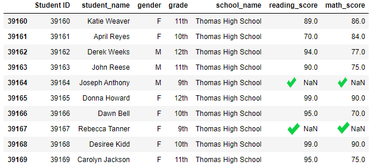
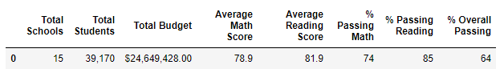
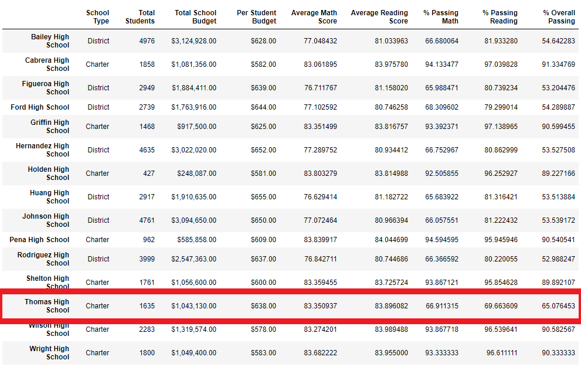
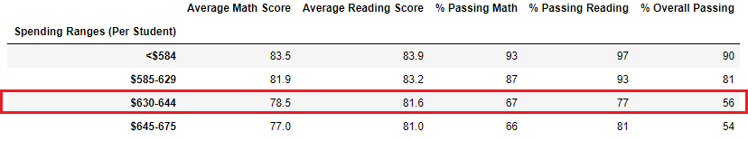
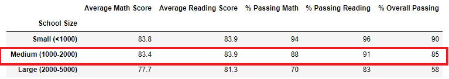
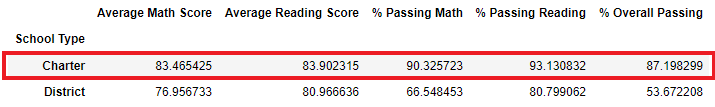

# School_District_Analysis.
Analysis of School District Using Jupyter Notebook

## Project Overview
Previous analysis indicated some evidence of academdic dishonesty; specifically the reading and math grades for Thomas High School ninth (9th) greaders. These appered to have been altered somehow - the degree as to how much has not been fully understood as yet. The school board has asked to:

1. Replace ninth (9th) grade reading and match scores
2. Repeat the school district analysis
3. Pre pare a report that details how the changes affected the overall analysis

Working with the `students_complete.csv` dataset, Pandas `loc` method and conditional statements with comparison and logical operators will be used to find the requested results. The results will be printed to the command line and saved to file `PyCitySchools_Challenge.ipynb`.

## Purpose
The purpose of this analysis is to identfy and replace the math and reading scores for Thomas High School with NaNs while keeping the rest of the data intact.

## Resources
- **Data Source:** challenge starter code.ipynb, students_complete.csv, schools_complete.csv
- **Software:** Anaconda 4.8.3, Jupyter Notebook 6.0.3, Visual Code 1.47, Python 3.7.6

## School District Results
The previous analysis perfomed indicated that information has been altered. The initiative have been made to replace those grades with NaNs. To do so the below scipt following script was applied utilizing the `loc` method:
> Step 2. Use the loc method on the student_data_df to select all the reading scores from the 9th grade at Thomas High School and replace them with NaN
>   student_data_df.loc[(student_data_df["school_name"] == "Thomas High School") & (student_data_df["grade"] =="9th") & (student_data_df["reading_score"] <= 100),"reading_score"] = np.nan

The above code was refactored soon after to replace match scores with NaNs using:
>Step 3. Refactor the code in Step 2 to replace the math scores with NaN.
>   student_data_df.loc[(student_data_df["school_name"] == "Thomas High School") & (student_data_df["grade"] =="9th") & (student_data_df["math_score"] <= 100),"math_score"] = np.nan

Last a check was performed on thw student data to ensure that the grades were replaced with NaNs. please see the code used below:
>#Step 4. Check the student data for NaN's. 
>   student_data_df.tail(10)

>**Table showing a check on student data for NaNs from the Terminal:**
>
>

### District Summary Results
>The change impact that the change had on the metrics as it pertain to the each school district differs slighlty
>1. Average Math Score reduced slightly by `0.05`. This metric went from `78.99` to `78.93`.
>2. Average Reading Score reduced by `0.02`. This metric went from `81.88` to `81.86`.
>3. % Passing Math reduced by `1.10%`. This went from `74.98%` to `73.88%`.
>4. % Passing Reading reduced by `1.1%`. This went from `85.81%` to `84.65%`
>5. % Overall Passing reduced by `1.08%`. This went from `65.17%` to `64.09%`.
>6. Total Budget and Total Students metrics remained the same. There are no differences here since we are not removing any student and or school from the district. `24,649,428.00` and `39170` respectively.
>
>**Table showing School Summary Results from the Terminal:**
>
>

### School Summary Results
>1. No change was observed for Thomas High school as it relates to the Average Math Score. This metric went from `83.4` to `83.4`.
>2. The Average Reading Score increased by slightly by `0.1`. This metric went from `83.8` to `83.9`.
>3. % Passing Math reduced by `1.10%`. This went from `93.3%` to `66.9`.
>4. % Passing Reading reduced by `1.1%`. This went from `97.3%` to `69.7%`.
>5. % Overall Passing reduced by `1.08%`. This went from `90.9%` to `65.07%`.
>6. With the descrepancies removed from the dataset, it is now clear that the correct number of students that passed the Math and Reading test at Thomas High School is `1, 064` from the `1, 635` students that too the test.
>**Table showing School Summary Results from the Terminal:**
>
>

### How does replacing the ninth graders’ math and reading scores affect Thomas High School’s performance relative to the other schools?
> By replacing the ninth (9th) graders scores from Thomas High school, the performance of said school went from  went from number two (2) on the list to eighth as it relates to the school's performance compared to the other schools on said list.

### How does replacing the ninth graders’ math and reading scores affect Thomas High School’s performance relative to the other schools:
>**Math and reading Scores by Grade:**
>- Grades ten to twelve (10-12) scores remains unchanged, since the changes made were only applied to grade nine (9), where scores where changed to reflect NaNs, which indicates that there are no scores in place.
>
>
>**Table showing Thomas High School’s performance relative to the other schools from the Terminal:**
>
>

>**Scores by School Spending:**
>
>The spending range per student in the bin category of `$630-644` are: 
>- % passing Math changed from `73` to `67`; 
>- % Passing Reading changed from 84 to `77` and 
>- % of Overall Passing reduced from 63 to `56`.
>
>This resulted in a change of `6%`, `7%` and `7%` respectively due to the replacement of the ninth-grade scores for Thomas high school.
>
>
>**Table showing School Spending Results from the Terminal:**
>
>

>**Scores by School Size:**
>
>Thomas High Shool can be categorized as a medium school and so falls in the `(1000-2000)` bin size; this metrics have been reduced significantly for this school. The results are as follows: 
>- % passing math went from `94` to `88`, 
>- % passing reading from `97` to `91`, and 
>- % Overall passing from `91` to `85`. 
>
>All reduced by  `6%` respectively.
>
>
>**Table showing School Size Results from the Terminal:**
>
>

>**Scores by School Type**
>
>Thomas High School is considered to be a Charter school and therefore, the changes will be more impactful within this category. The results of these changes are: 
>- % passing math from `94` to `90`, 
>- % passing reading from `97` to `93`, and 
>- % Overall passing from `90` to `87` 
>
>Overall this indicates a reduction of `4%`, `4%` and `3%` respectively.
>
>
>**Table showing Elections Results from Terminal:**
>
>
  
## School District Summary
>**Four major changes to the school district analysis after reading and math scores have been replaced are:**
>1. The district and school summary DataFrames were reassessed. Changes made reflected a reduction between `1%` and `1.08%`
>2. The High-Low performing schools outcome was recalculated. This resulted in Thomas High moving to number `8th` on the list in regards to performance.
>3. Score by grade, school spending, school size and school type were recalculated. Here a significant reduction was spotted and can be anywhere between `6%` and `7%`.
>4. No scores were submitted for Thomas High ninth (9th) grade.

